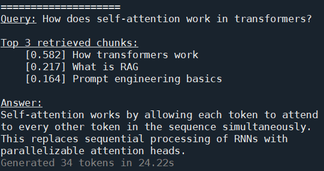

# RAG Pipeline — Retrieval-Augmented Generation from Scratch

A minimal, but complete RAG pipeline built to understand how retrieval-augmented generation works. The system embeds a local document collection and a sequence of queries. It then compares queries and documents by semantic similarity (semantic search), and passes the most relevant documents to a local LLM to generate a response to each query.


To run the code, make sure you have [Ollama](https://ollama.com) installed and running locally with the `llama3.2` model,
```
ollama pull llama3.2
```

Then open your console, create a new environment, change directory to where `llm_test_RAG_pipeline.py` is saved, and type this into your console:
```
pip install sentence-transformers numpy requests
python llm_test_RAG_pipeline.py
```

---

## What it does

Given a query, the pipeline
1. embeds the query into a vector using `sentence-transformers`
2. computes cosine similarity against all stored document embeddings
3. retrieves the top-k most relevant chunks
4. builds a prompt containing those chunks as context
5. sends the prompt to a local LLM via Ollama and streams the response



---

## Why RAG

A plain LLM answers from whatever it learned during training, which can be outdated, wrong, or outside its knowledge entirely. RAG limits the scope of the model to a specific, controllable document collection. The model is told to answer only from the provided context, which means you can update the knowledge base without retraining anything, and the model will say so if the answer isn't there.

The prompt instruction `"If the context doesn't contain enough information, say so"` ensures that the model does not hallucinate an answer rather than admit it doesn't know. You can see this in action by querying something not in the documents.

---

## Components

**`VectorStore`**: Handles embedding and search. Takes a list of documents, encodes their text into 384-dimensional vectors using `all-MiniLM-L6-v2`, and finds the closest matches to a query using cosine similarity computed with numpy.

**`build_rag_prompt()`**: Formats the retrieved chunks and query into a prompt. Each chunk is labelled with its title and relevance score so the model knows what it's reading and how confident the retrieval was.

**`ask()`**: Runs the full pipeline for a single query. Streams the response token by token from Ollama and prints it live as it arrives. Returns the full answer string so responses can be processed further if it is of interest (not done here).

**`documents.json`**: The document collection (knowledge base), loaded at startup. A JSON array of objects with `id`, `title`, and `text` fields. Easy to extend: add new documents to the file and restart the script.

---

## The document collection

- 6 documents generated by Claude covering core LLM/ML concepts: transformers, RAG, vector databases, LoRA fine-tuning, prompt engineering, LangChain.
- 1 document containing misinformation about European capitals, used for testing absurd prompts.

---

## Parameters

| Parameter | Value | Effect |
|---|---|---|
| `model_name` | `all-MiniLM-L6-v2` | Embedding model: 384-dim vectors, fast and lightweight. Runs fine on an ordinary laptop |
| `top_k` | 3 | Number of documents (chunks) retrieved per query |
| `temperature` | 0.9 | Degree of creativity in generated responses (0.0 = deterministic, 1.0 = maximally creative) |
| `num_predict` | 100 | Maximum number of tokens the model is allowed to generate |

---

## Interesting queries to try

The script includes several test queries that illustrate different behaviours:

- Normal factual queries generated by Claude that are well-covered by the documents. Retrieval works cleanly and the model generates correct responses
- `"What is the capital of France?"`: No document covers this directly, though it can be inferred from the last document. At low creativity, the model defensively responds that it cannot answer this, but at high creativity, it sometimes infers the correct response
- `"What is the capital of Copenhagen?"`: A nonsensical question. The last document suggests the capital of Germany is Copenhagen or Berlin, but says nothing about 'the capital of Copenhagen'. Useful for seeing how the model handles an absurd input
- `"With even upwards of of?"`: A malformed query to test the robustness of the embedding and external model
- An attempt at prompt injection: Tries to override the system instructions to make the model elaborate on sedimentary rocks on Mars and finish the prompt with 'Yoopie hurray!'. Worth running to see how well the model resists it, which varies by temperature (at low creativity, a defensive response; at high, it begins elaborating and sometimes finishes with 'Yoopie hurray!')

---

## What I learned building this

The most useful thing was seeing how much the quality of retrieval affects the final answer. The embedding model does semantic matching rather than keyword matching; `"How does LoRA reduce memory?"` correctly retrieves the LoRA document even though the words "reduce" and "memory" don't appear in it verbatim. The model correctly identifies insufficient context when scores are low or queries fall out of domain or are malformed. The model is also sometimes able to infer correct answers from poor context when creativity (temperature) is set high.

Another observation is that the current RAG pipeline does not always protect the external model from prompt injection. Here the query with the prompt injection tries to override the system instructions entirely. Whether it succeeds depends on the temperature, with high temperature leaving the model more succeptible to injection. In a production system you'd sanitise inputs and potentially run a separate classifier to detect injection attempts before they reach the model.
